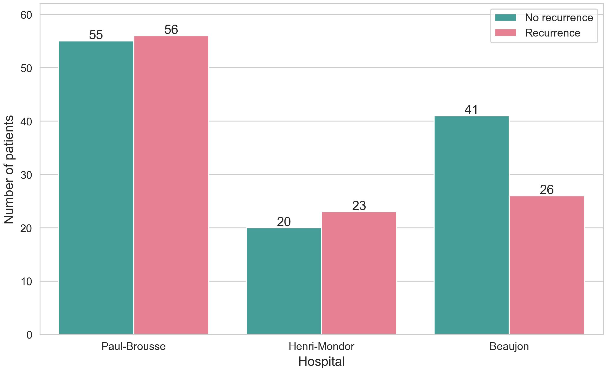
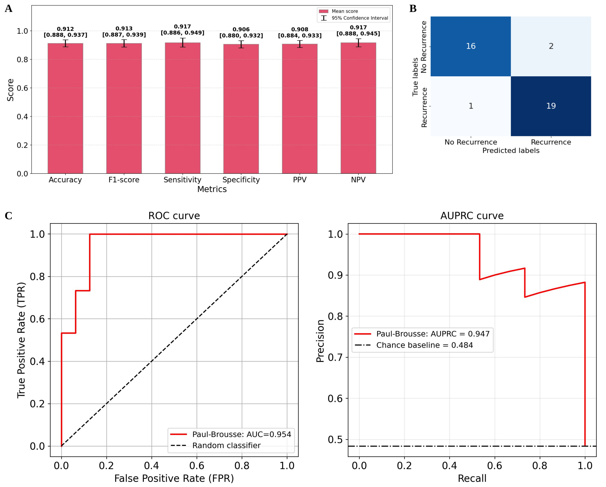

# Machine Learning Model Integrating Computational Pathology to Predict Early Recurrence of Hepatocellular Carcinoma after Resection

This repository contains the code and supplementary materials for our article:
*Machine Learning Model Integrating Computational Pathology to Predict Early Recurrence of Hepatocellular Carcinoma after Resection*

__Authors:__ Astrid Laurent-Bellue*, Aymen Sadraoui*, Aurélie Beaufrère, Julien Calderaro, Katia Posseme, Véronique Bruna, Antoinette Lemoine, Agnès Bourillon, Antonio Sa Cunha, Daniel Cherqui, Eric Vibert, Olivier Rosmorduc, Valérie Paradis, Maïté Lewin, Jean-Christophe Pesquet, Catherine Guettier
*These authors contributed equally to this work
  


## Repository Structure
```
🧬 ML-Model-Integrating-Computational-Pathology-to-Predict-Early-Recurrence-of-HCC
    └── 💾checkpoints
    │    ├── 📁coords_pickles
    │    ├── 📁tumor_pickles
    ├── 🗃️data
    │    ├── 📁patches
    │    ├── 📁tabs
    │    └── 📁WSIs
    ├── 🧪experiments
    ├── 🖼️figures
    ├── 🤖models
    │    ├── TripleIndepResNet34_Fold1.pt
    │    ├── TripleIndepResNet34_Fold2.pt
    │    ├── TripleIndepResNet34_Fold3.pt
    │    ├── TripleIndepResNet34_Fold4.pt
    │    └── TripleIndepResNet34_Fold5.pt
    ├── 📓notebooks
    │    ├── color_transfer_from_PB_to_external.ipynb
    │    ├── init_inflam_detection_with_Tia.ipynb
    │    ├── STEP1_gen_patches_from_WSI.ipynb
    │    ├── STEP2_detect_tumor_from_WSI.ipynb
    │    └── STEP3_detect_inflammatory_cells.ipynb
    ├── 📊results
    │    ├── 📁overview_preds_tumor_wsis
    │    └── 📁overview_wsis
    ├── 📜scripts
    │    ├── run_step1.sh
    │    └── run_step2.sh
    ├── 🧩src
    │    ├── STEP0_create_directories.py
    │    ├── STEP1_gen_patches_from_WSI.py
    │    └── STEP2_detect_tumor_from_WSI.py
    ├── 🛠️utils
    │    ├── ImageSet.py
    │    ├── init.py
    │    ├── model_archi.py
    │    ├── utils_inflams.py
    │    ├── utils_tumor.py
    │    └── utils.py
    ├── .gitignore
    ├── config.yaml
    ├── LICENSE
    ├── README.md
    ├── requirements.txt
    └── setup.py
```

## Data


## Results
### Main cohort: Paul-Brousse
  

### External cohorts: Henri-Mondor & Beaujon
 